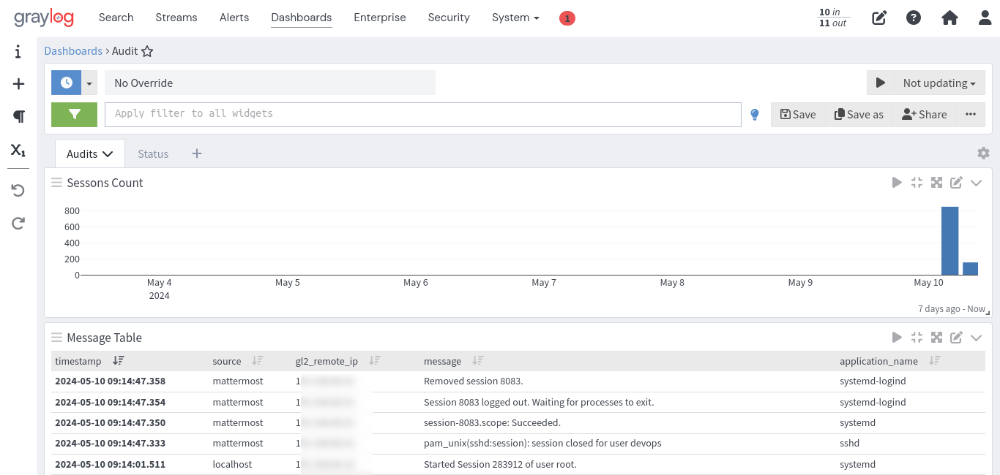
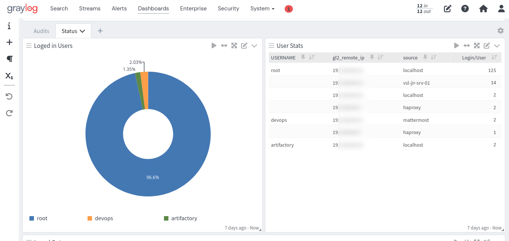

# SSH Session Monitor for Graylog

Welcome to the SSH Session Monitor content pack for Graylog This pack is designed to provide you with a comprehensive dashboard to keep an eye on SSH login and logout activities within your Graylog environment. Whether you're looking to enhance security, troubleshoot access issues, or simply gain better visibility into your system's SSH activity, this content pack is your go-to solution.

## Key Features

- **Real-time Monitoring**: Stay updated with the latest SSH login and logout events as they happen.
- **Detailed Insights**: Dive deep into the data to understand user behavior, identify patterns, and detect anomalies.
- **Customizable Dashboard**: Tailor the dashboard to your needs, focusing on the metrics that matter most to you.

## Getting Started

To get started with the SSH Session Monitor content pack, follow these simple steps:

1. **Installation**: Add the content pack to your Graylog instance. Detailed installation instructions can be found in the [Installation Guide](#).
2. **Configuration**: Customize the dashboard to fit your monitoring needs. The [Configuration Guide](#) provides step-by-step instructions.
3. **Monitoring**: Once set up, start monitoring your SSH sessions. The dashboard will automatically update with the latest data.

## Documentation

For more detailed information on how to install, configure, and use the SSH Session Monitor content pack, please refer to the following guides:

- [Installation Guide](#)
- [Configuration Guide](#)

## Support

If you encounter any issues or have questions, please reach out to our support team. We're here to help!

# Screenshots

